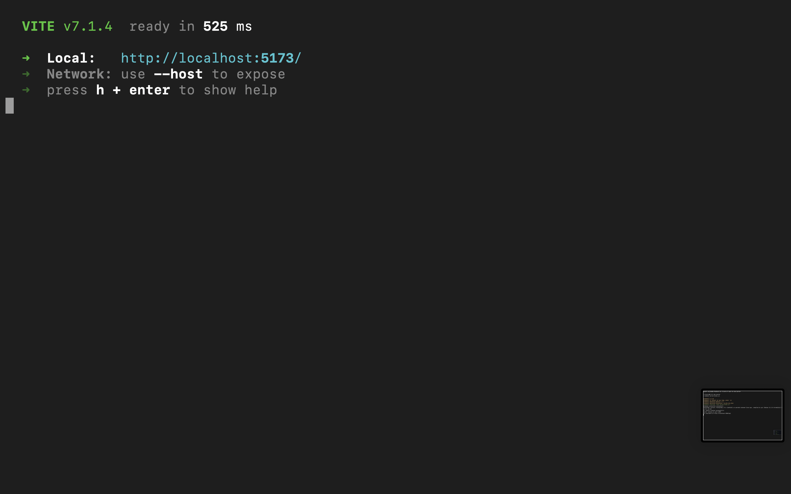
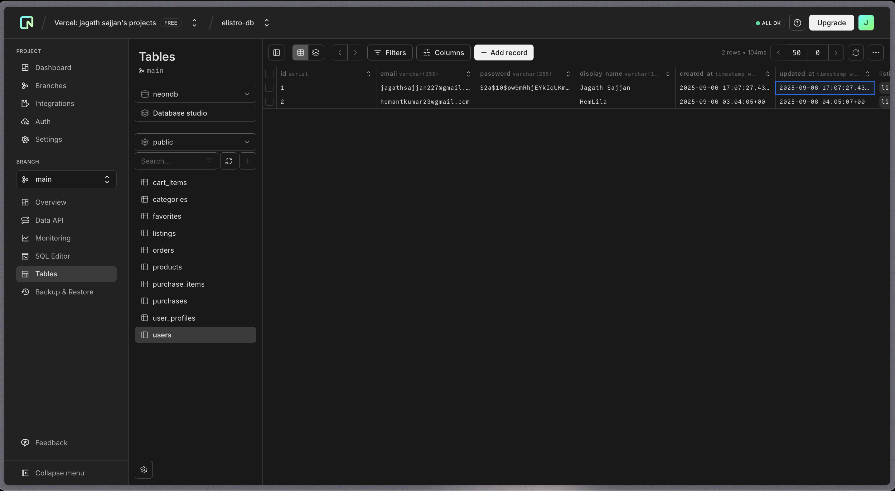
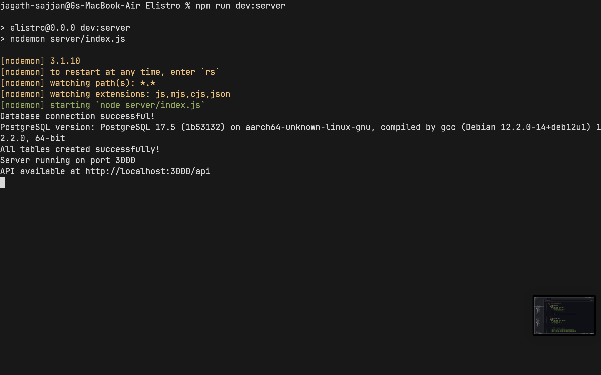

# 🛒 Elistro - Modern Marketplace Application



> **⚠️ Hackathon MVP Status**: This project currently has a **fully functional backend** with a **lost frontend**. The backend API is complete and working, ready for frontend integration.

## 📋 Overview

**Elistro** is a modern marketplace application that was developed as a hackathon MVP project. It features a robust backend API built with Express.js and Neon Postgres, designed to support a full-featured e-commerce platform with neubrutalist design principles.

### 🚀 Project Status
- ✅ **Backend**: Fully functional with complete API endpoints
- ❌ **Frontend**: Lost during development (needs to be rebuilt)
- ✅ **Database**: Complete schema with all necessary tables
- ✅ **Authentication**: JWT-based auth system implemented

## 🛠️ Tech Stack

### Backend (✅ Working)
- **Express.js** - Node.js web framework
- **Neon Postgres** - Serverless PostgreSQL database
- **JWT** - Authentication and session management
- **bcryptjs** - Password hashing
- **CORS** - Cross-origin resource sharing

### Frontend (❌ Lost)
- **Vue 3** - Progressive JavaScript framework
- **TypeScript** - Type-safe JavaScript
- **Pinia** - State management
- **Vue Router** - Client-side routing
- **Tailwind CSS** - Utility-first CSS framework
- **Axios** - HTTP client for API requests

### Database
- **Neon Postgres** - Cloud-native serverless PostgreSQL

## 🎯 Features

### ✅ Implemented (Backend API)
- User authentication (signup, login, JWT tokens)
- User profile management
- Product listings with CRUD operations
- Shopping cart functionality
- Purchase history tracking
- Category-based product filtering
- Database health checks

### 🔄 Needs Frontend Implementation
- Product browsing interface
- User authentication UI
- Shopping cart interface
- Product details pages
- User dashboard
- Neubrutalist design system

## 📊 Database Schema


The application uses a well-structured relational database with the following main tables:

### Core Tables
- **users** - User accounts and authentication
- **listings** - Product listings with details
- **cart_items** - Shopping cart management
- **purchases** - Order tracking
- **purchase_items** - Individual items within orders



## 🚀 Getting Started

### Prerequisites
- Node.js (v16 or higher)
- npm or yarn
- Neon Postgres account
- Neon Auth project setup

### Environment Setup

Create a `.env` file in the root directory:

```bash
# Database
DATABASE_URL='your-neon-postgres-connection-string'

# Neon Auth
STACK_PROJECT_ID='your-neon-auth-project-id'
STACK_PUBLISHABLE_CLIENT_KEY='your-neon-auth-publishable-key'
STACK_SECRET_SERVER_KEY='your-neon-auth-secret-key'

# JWT
JWT_SECRET='your-jwt-secret'
JWT_EXPIRES_IN='24h'

# Server
PORT=3000
NODE_ENV=development
```

### Installation & Running

1. **Install dependencies:**
```bash
npm install
```

2. **Start the backend server:**
```bash
npm run dev:server
# or
npm run server
```

3. **The API will be available at:**
```
http://localhost:3000/api
```



## 📡 API Endpoints

### Authentication
- `POST /api/auth/register` - User registration
- `POST /api/auth/login` - User login
- `GET /api/auth/profile` - Get user profile

### Listings
- `GET /api/listings` - Get all product listings
- `POST /api/listings` - Create new listing
- `PUT /api/listings/:id` - Update listing
- `DELETE /api/listings/:id` - Delete listing

### Cart
- `GET /api/cart` - Get user's cart
- `POST /api/cart` - Add item to cart
- `PUT /api/cart/:id` - Update cart item
- `DELETE /api/cart/:id` - Remove from cart

### Purchases
- `GET /api/purchases` - Get purchase history
- `POST /api/purchases` - Create new purchase

### Health Check
- `GET /api/health` - Check API and database status

## 🏗️ Project Structure

```
Elistro/
├── server/                 # Backend API (✅ Working)
│   ├── routes/            # API route handlers
│   ├── db/                # Database configuration & schema
│   └── index.js           # Express server entry point
├── src/                   # Frontend source (❌ Lost)
│   ├── components/        # Vue components
│   ├── router/           # Vue Router configuration
│   ├── services/         # API service layer
│   ├── stores/           # Pinia state management
│   └── main.ts           # Frontend entry point
├── images-readme/         # Project screenshots
├── public/               # Static assets
├── package.json          # Project dependencies
└── README.md             # This file
```

## 🔧 Development

### Backend Development
The backend is fully functional and includes:
- RESTful API design
- Database migrations and schema management
- JWT authentication middleware
- Error handling and logging
- CORS configuration
- Health check endpoints

### Frontend Reconstruction Needed
To complete this project, you'll need to rebuild the frontend using:
- Vue 3 with Composition API
- TypeScript for type safety
- Pinia for state management
- Tailwind CSS for styling
- Axios for API integration

## 🎨 Design System

The original design followed **neubrutalist** principles:
- Bold, contrasting colors
- Thick borders and shadows
- Geometric shapes
- High contrast typography
- Minimalist yet impactful UI elements

## 👥 Team

**Lafda-Gang Team:**
- [@jagath-sajjan](https://github.com/jagath-sajjan) - Backend Developer
- [@Hemanth-kumar23](https://github.com/Hemanth-kumar23) - Full Stack Developer

## 🏆 Hackathon Project

This was developed as a **hackathon MVP** with the following constraints:
- ⏰ Limited time frame
- 🎯 Focus on core functionality
- 🚀 Rapid prototyping approach
- 📱 Modern tech stack usage

## 🔮 Future Development

To complete the marketplace:

### Immediate Priorities
1. **Rebuild Frontend** - Vue 3 + TypeScript implementation
2. **UI/UX Design** - Implement neubrutalist design system
3. **Responsive Design** - Mobile-first approach

### Feature Enhancements
- Payment integration (Stripe/PayPal)
- Product image upload functionality
- Advanced search and filtering
- User reviews and ratings
- Seller dashboard
- Order management system
- Email notifications
- Real-time chat support

## 📄 License

This project is part of a hackathon submission and is available for educational and development purposes.

## 🤝 Contributing

Since this is a hackathon MVP with a lost frontend:

1. **Frontend Contributors Welcome!** - Help rebuild the Vue.js frontend
2. **Backend Improvements** - API enhancements and optimizations
3. **Documentation** - Improve setup and usage documentation
4. **Testing** - Add comprehensive test coverage

## 📞 Support

For questions about the backend API or project setup:
- Create an issue in the repository
- Contact the development team
- Review the API documentation above

---

> **Note**: This README serves as both documentation for the working backend and a roadmap for rebuilding the lost frontend. The backend is production-ready and fully functional for marketplace operations.
